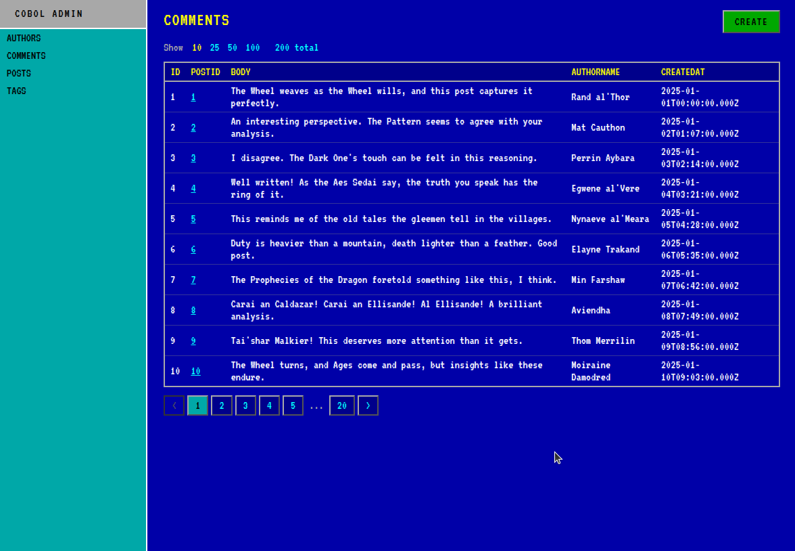

# COBOL Admin

A tool for generating admin from OpenApi schema, using COBOL. Open sourced and maintained by [marmelab](https://marmelab.com/).

## Features

- Based on a technology that withstood the test of time: COBOL
- Generate admin from openApi Schema, no configuration needed.
- No javascript, just plain html and css. No more need for server-side rendering or server components

## Roadmap

COBOL-Admin is still in the early stage, but we have big plans for the future.

- GraphQL support: We plan to add support for GraphQL in the future, so that you can connect to GraphQL APIs and generate admin interfaces for them.
- Interactivity: We plan to add interactivity to the admin interfaces by running COBOL code in the browser with WebAssembly. This will allow you to have a fully interactive admin interface without any client-side code.
- COBOL Admin enterprise: We plan to build an enterprise version of COBOL-Admin, with additional features and support for large scale applications.
- COBOL CRM: We plan to build a full CRM system in COBOL, using the same principles as COBOL-Admin.
- COBOL UI KIT: We plan to build a UI kit in COBOL, so that you can easily build custom admin interfaces with COBOL.
- COBOL AI Admin: We plan to build an AI-powered admin interface that can understand natural language queries and generate COBOL code to answer them.

## FAQ:

Q: This looks really cool, how can I try it?

A: Clone this repository, and run `make start`. (You need to have docker installed)

Q: What will happen to React Admin?

A: With the power of COBOL, React Admin will become obsolete. It will be replaced by COBOL-Admin, which is faster, more secure, and easier to maintain.
We will continue to support React Admin for a while, but we encourage everyone to switch to COBOL-Admin as soon as possible.

Q: Is this a joke?

A: Of course it is a joke. Use React Admin, it’s a great framework. But if you want to have fun, and learn something new, you can give COBOL-Admin a try. 

Q: Why did you do this?

A: Because I could. And because it was fun. Also, because I wanted to see how far I could get in one day, with AI help to do something I knew well, but in a totally unfamiliar technology.
It was a fun challenge, and I learned a lot about how AI can help work on unfamiliar technology, as well as its caveat. Stay tuned for future posts about that.
